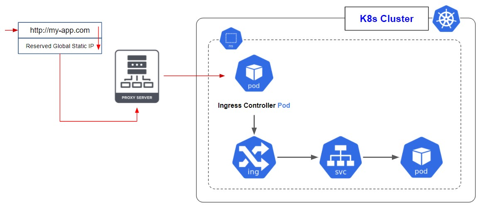

## **Kubernetes Ingress**

To make your services and pods available to the internet and make them acceible through domain names and paths, you need to configure ingress for your services.
Ingress takes the requests from outside cluster and validates some rules, then navigates the request to the right pod using the predefined paths in the ingress configuration. You will need these to make the ingress working:

- Valid global ip address
- Valid domain name
- Ingress controller enabled on the cluster
- Define routes in ingress

Usually, there is a proxy server which takes the requests from http(s) and routes them to your cluster. So, the domain name will be resolved to an IP address which is the IP address of the proxy server, and the proxy server sends the traffic to the cluster.

**Tip: make sure that you point the proxy server to the entry point of your cluster. Which in our case, it would be the `ingress controller`.**



### **Enable Ingress**

There are several implementations of the ingress.

- nginx ingress
- gce ingress
- ...

When you create an ingress object, you can set its type with annotations. If you don't set any annotation, it will be the default which is google's default `gce`. Here is a sample of ingress object:

```
apiVersion: networking.k8s.io/v1
kind: Ingress
metadata:
  name: my-ingress
  namespace: default
spec:
  rules:
    - host: example.com
      http:
        paths:
          - path: /
            pathType: ImplementationSpecific
            backend:
              service:
                name: my-products
                port:
                  number: 60000
          - path: /discounted
            pathType: ImplementationSpecific
            backend:
              service:
                name: my-discounted-products
                port:
                  number: 80
```

Then, you should define services for each `backend`:

```
apiVersion: v1
kind: Service
metadata:
  name: my-products
spec:
  type: NodePort
  selector:
    app: products
    department: sales
  ports:
  - protocol: TCP
    port: 60000
    targetPort: 50000
```

In the Service manifest, you must use `type: NodePort` unless you're using container native load balancing. If using container native load balancing, use the `type: ClusterIP`.

## Default Backend

If no route is matched in ingress routes, you can route the traffic to a default service. The following example routes the unmatched traffic to the default service:

```
apiVersion: networking.k8s.io/v1
kind: Ingress
metadata:
  name: my-ingress
  namespace: default
spec:
  defaultBackend:
    service:
      name: my-products
      port:
        number: 60001
  rules:
    - host: example.com
      http:
        paths:
          - path: /
            pathType: ImplementationSpecific
            backend:
              service:
                name: my-products
                port:
                  number: 60000
          - path: /discounted
            pathType: ImplementationSpecific
            backend:
              service:
                name: my-discounted-products
                port:
                  number: 80

```

**Important Tips:**

- Make sure that the `service: name` and `service: port` in ingress object, match the `Service` object that you have defined for your service.

- Make sure that ingress namespace is same as services and pods namespace.

### Multiple Domains

If you have different domains, instead of different paths, you can do define your ingress like the following example:

```
apiVersion: networking.k8s.io/v1
kind: Ingress
metadata:
  name: my-ingress
  namespace: default
spec:
  defaultBackend:
    service:
      name: my-products
      port:
        number: 60001
  rules:
    - host: example.com
      http:
        paths:
          - path: /
            pathType: ImplementationSpecific
            backend:
              service:
                name: my-products
                port:
                  number: 60000
    - host: discounted.example.com
      http:
        paths:
          - path: /
            pathType: ImplementationSpecific
            backend:
              service:
                name: my-discounted-products
                port:
                  number: 80
```

### **TLS Certificates**

There are several ways to activate the tls certificates for your services.

- Google Managed Certificates
- Kubernetes Secrets for Self-Managed Certificates

### 1. Google Managed Certificate

**Tip: Unlike self-managed certificates, Google-managed certificates do not support wildcard domains.** So you should define each domain and sub-domain for your certificates.

To use google `managedcertificate` you need the following requirements:

- You must own a domain name.
- You must create a **reserved (static) external IP address**.

You can create the reserved (static) external IP address on google using the following commands:

```
gcloud compute addresses create ADDRESS_NAME --global
```

Then, review if the address is ready:

```
gcloud compute addresses describe ADDRESS_NAME --global
```

Then, create a `ManagedCertificate` resource:

```
apiVersion: networking.gke.io/v1
kind: ManagedCertificate
metadata:
  name: managed-cert
spec:
  domains:
    - DOMAIN_NAME1
    - DOMAIN_NAME2
```

Note that google managed certificate, does not support wildcards in domains. So, if you want to have `example.com` and `www.example.com` you should specify both in the `domains`.

Also, you need a `Service`:

```
apiVersion: v1
kind: Service
metadata:
  name: mc-service
spec:
  selector:
    app: mc-service
  type: NodePort
  ports:
    - protocol: TCP
      port: 80
      targetPort: 8080
```

Then, you should configure the ingress resource:

```
apiVersion: networking.k8s.io/v1
kind: Ingress
metadata:
  name: webapp-ingress
  annotations:
    kubernetes.io/ingress.class: "gce"
    networking.gke.io/managed-certificates: managed-cert
    kubernetes.io/ingress.global-static-ip-name: ADDRESS_NAME
spec:
  rules:
    - host: example.com
      http:
        paths:
          - path: /*
            pathType: ImplementationSpecific
            backend:
              service:
                name: webapp-service
                port:
                  number: 80
```

**Tips:**

1. ingress.class should be "gce". (`kubernetes.io/ingress.class: "gce"`)
2. `networking.gke.io/managed-certificates` should be mapped to the name of the `ManagedCertificate` resource that you already created.
3. `kubernetes.io/ingress.global-static-ip-name` value should be the name of the static IP that you created on google.

After you apply these changes to the kubernetes cluster, you will have an ingress on your GKE cluster. You should get the ingress IP address:

```
kubectl get ingress
```

This IP address is equivalant to the IP static that you already reserved on google.

Make sure that your domain name resolves to this IP address. So, if you run the following command you can see if the tls certificate is ready or not. It might take about 30 minutes:

```
kubectl describe managedcertificate managed-cert
```

Once the certificate is ready for your domains it will show `ACTIVE` as its status and you can browse using `https`.

**Note:** if the domain is not configured in the DNS and if you don't define A records for your domain, the certificate will not be provisioned. Because the domain is not accessible. So, make sure that you add an `A` record to DNS and map it to the entry point IP address. Which in our case, in the static IP address of the ingress.

### 2. Secret

If you want to enable tls certificates for your domain, you can add `tls` section to your ingress object:

```
apiVersion: networking.k8s.io/v1
kind: Ingress
metadata:
  name: my-ingress
  namespace: default
spec:
  tls:
    - hosts:
        - example.com
        secretName: myapp-secret-tls
  rules:
    - host: example.com
      http:
        paths:
          - path: /
            pathType: ImplementationSpecific
            backend:
              service:
                name: my-products
                port:
                  number: 60000

```

Then, you should define a `Secret` object to hold your tls certificate info:

```
apiVersion: v1
kind: Secret
metadata:
  name: myapp-secret-tls
  namespace: default
data:
  tls.crt: base64 encoded cert
  tls.key: base64 encoded key
type: kubernetes.io/tls
```

**Tip:** `tls.crt` and `tls.key` contain values, not paths/locations to the files.
