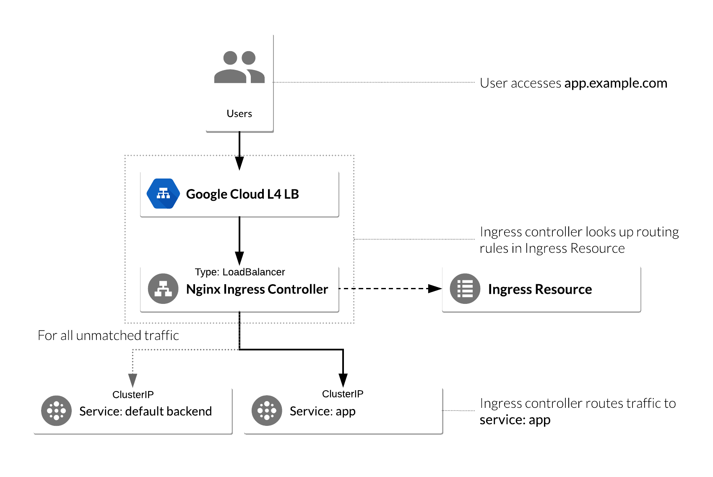

In this guide we will setup ingress on GKE. For ingress, we need to have an `ingress controller` and `ingress resource`s. Ingress Controller is the entry point of the cluster and this controller receives external requests. In order to route the traffic to the right service, Ingress Controller uses Ingress Resources (`Kind: Ingress`) to match the rules and find the right service for the incoming request.

Google Kubernetes Engine comes with a default ingress which is called `gce` and it already exists on the cluster. So, we won't need to install an ingress controller anymore. However, I will be using `nginx.ingress`. So, I need to install the `ingress controller` and make sure it is ready to use.



## **Deploy NGINX Ingress Controller**

Open the cloud shell on google cloud platform and use `helm` to install `nginx.ingress`:

Add the `nginx-stable` Helm repository:

```sh
helm repo add ingress-nginx https://kubernetes.github.io/ingress-nginx
helm repo update
```

Deploy `nginx-ingress` using Helm:

```sh
helm install nginx-ingress ingress-nginx/ingress-nginx
```

Verify if the nginx is ready. You should wait until you see an external IP being attached to the nginx ingress service:

```sh
kubectl get deployment nginx-ingress-ingress-nginx-controller
kubectl get service nginx-ingress-ingress-nginx-controller
```

Use the following to watch the service until you see the external IP:

```sh
watch kubectl get service nginx-ingress-ingress-nginx-controller
```

Export the external IP for later use and verify the environment variable value:

```sh
export NGINX_INGRESS_IP=$(kubectl get service nginx-ingress-ingress-nginx-controller -ojson | jq -r '.status.loadBalancer.ingress[].ip')

echo $NGINX_INGRESS_IP
```

## **Configure Ingress Resource to use NGINX Ingress**

An Ingress Resource object is a collection of L7 rules for routing inbound traffic to Kubernetes Services. Multiple rules can be defined in one Ingress Resource, or they can be split up into multiple Ingress Resource manifests. The Ingress Resource also determines which controller to use to serve traffic. This can be set with an annotation, `kubernetes.io/ingress.class`, in the metadata section of the Ingress Resource. For the NGINX controller, use the value `nginx`:

```yaml
annotations: kubernetes.io/ingress.class: nginx
```

If we don't define any annotation in ingress resources, they will use the default ingress controller which is `gce`. The following example is a sample ingress resource:

```yaml
apiVersion: networking.k8s.io/v1
kind: Ingress
metadata:
  name: ingress-resource
  annotations:
    kubernetes.io/ingress.class: nginx
    nginx.ingress.kubernetes.io/from-to-www-redirect: "true"
    nginx.ingress.kubernetes.io/ssl-redirect: "true"
    nginx.ingress.kubernetes.io/preserve-trailing-slash: "true"
    nginx.ingress.kubernetes.io/backend-protocol: https
    nginx.ingress.kubernetes.io/force-ssl-redirect: "true"
    nginx.ingress.kubernetes.io/rewrite-target: /
spec:
  rules:
    - host: "{{domain.com}}"
      # - host: "34.122.88.204.nip.io"
      http:
        paths:
          - pathType: Prefix
            path: "/hello"
            backend:
              service:
                name: hello-app
                port:
                  number: 8080
```

For the host, you need to use a FQDN (Fully Qualified Domain Name). If you don't have a domain, and you still want to test with only ip address that you got from the nginx ingress service, you can use a service like `nio.io` to combine your ip with a domain. For example, if your external IP is `34.122.88.204`, you can use `34.122.88.204.nip.io` as your host name.

Now, you need to apply the ingress resource to the cluster:

```
kubectl apply -f ingress-resource.yaml
```

You might need to wait for a while before you can test your access to the service. So, please test multiple times after a while. You're all set!
