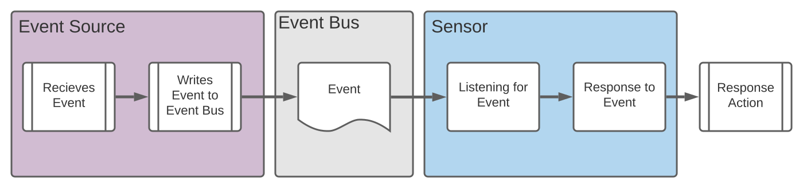

## **Installing and using argo events**

### **What is Argo Events?**

Argo Events helps to wait for some dependencies, and if dependency exists and resolves, would trigger Kubernetes objects. In other words, argo events listens for some events, and if the event is successfull, it will trigger a Kubernetes object and passes the values from the event to the kubernetes objects.

### **Installation**

Create cluster and configure `kubectl`:

```
PROJECT_ID=$(gcloud config list --format 'value(core.project)')

gcloud container clusters create sandbox-cluster   --release-channel regular   --workload-pool=$PROJECT_ID.svc.id.goog

gcloud container clusters get-credentials sandbox-cluster
```

```
kubectl create ns argo-events
```

Deploy the argo-events:

```
kubectl apply -f https://raw.githubusercontent.com/argoproj/argo-events/stable/manifests/install.yaml
# Install with a validating admission controller
kubectl apply -f https://raw.githubusercontent.com/argoproj/argo-events/stable/manifests/install-validating-webhook.yaml
```

On GKE, we need the following:

```
kubectl create clusterrolebinding YOURNAME-cluster-admin-binding --clusterrole=cluster-admin --user=YOUREMAIL@gmail.com
```

Deploy the eventbus:

```
kubectl apply -n argo-events -f https://raw.githubusercontent.com/argoproj/argo-events/stable/examples/eventbus/native.yaml
```

### **How to Use?**

In this guide, we will be using an event source to act as a webhook. When we call this webhook, it will pass the event to the event bus, then the result will be a trigger (sensor). The trigger will create a pod as the result.

In Argo Events there are 3 primary components:

- EventSource
- EventBus
- Trigger (Sensor)



Source: https://sdbrett.com/post/2021-06-18-integrate-argo-wf-events/

### **Event Sources**

The `eventsource` resource specifies how to utilize events from external services. For each type of external service, there is an EventSource resource object. Available event sources that are supported by Argo can be found [here](https://argoproj.github.io/argo-events/concepts/event_source/)

### **Event Bus**

Event Bus is a transparent service for events to go from Event Source to a Sensor (trigger).

### **Sensors**

Sensor specifies the Event Sources to watch for and the response to trigger if the event observed. Triggers might be HTTP Requests, Kubernetes Objects, Slack, and more.

We are using `webhook` as EventSource. Now, create the eventsource:

```
kubectl -n argo-events apply -f event-source.yaml
```

Let's verify the objects that are created:

```
kubectl -n argo-events get eventsource

kubectl -n argo-events get svc

kubectl -n argo-events get pods
```

Then, we want to have access to call the webhook. We are using ingress. Create an ingress and map the service.

```
kubectl -n argo-events apply -f ingress.yaml
```

We use the sample provided by `vfarcic`. So, let's clone it:

```
git clone https://github.com/vfarcic/argo-events-demo.git

cd argo-events-demo
```

All the codes being used by `vfarcic`: [gist](https://gist.github.com/vfarcic/a0a7ff04a7e22409cdfd8b466edb4e48)
