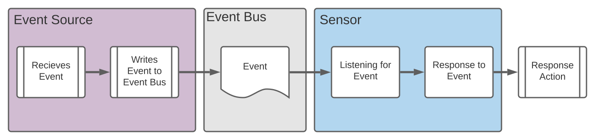

## **Argo Events**

In Argo Events there are 3 primary components:

- EventSource
- EventBus
- Trigger (Sensor)



Source: https://sdbrett.com/post/2021-06-18-integrate-argo-wf-events/

### **Event Sources**

The `eventsource` resource specifies how to utilize events from external services. For each type of external service, there is an EventSource resource object. Available event sources that are supported by Argo can be found [here](https://argoproj.github.io/argo-events/concepts/event_source/)

### **Event Bus**

Event Bus is a transparent service for events to go from Event Source to a Sensor (trigger).

### **Sensors**

Sensor specifies the Event Sources to watch for and the response to trigger if the event observed. Triggers might be HTTP Requests, Kubernetes Objects, Slack, and more.

## **Argo Workflows**

A `workflows` resource defines a task to execute. Execution is immediate. If you need to execute the task with delay or schedule it, you need `cronWorkflows` resource.
While installing the argo workflow, you define that the controller should watch its own namespace or the whole cluster. There are 2 deployment manifests which you choose one of them based on your desired configuration (cluster-wide or namespace). If you want to integrate `Argo Events` with `Argo Workflows` you should use the cluster-wide deployment manifest. Because `Argo Workflows` needs to observe resources in `argo-events` namespace. They are not in the same namespace.

The `default` service account of the namespace which the executor pod is running in is used if the workflows `spec.serviceAccountName` field is empty. This service account is required to execute the pod.

### **Steps:**

Environment Variables:

```
export CLUSTER_NAME=sandbox-cluster
export K8S_NAMESPACE=<kubernetes_service_account_namespace>
export KSA_NAME=<kubernetes_service_account>
export GSA_NAME=<google_service_account>
export CLUSTER_LOCATION=<k8s_cluster_location>
export PROJECT_ID= <gcp_project_id>
```

```
gcloud container clusters create $CLUSTER_NAME \
--num-nodes=2
```

### Install argo workflow:

```
kubectl create ns argo
kubectl -n argo apply -f https://raw.githubusercontent.com/argoproj/argo-workflows/stable/manifests/install.yaml
```

Access Workflow UI:

```
kubectl patch svc argo-server -n argo -p '{"spec": {"type": "LoadBalancer"}}'
```

Then, run the following command and wait until you get an external IP address:

```
kubectl get svc argo-server -n argo
```

### Install Argo Events

```
kubectl create ns argo-events

kubectl apply -f https://raw.githubusercontent.com/argoproj/argo-events/stable/manifests/install.yaml

kubectl apply -n argo-events -f https://raw.githubusercontent.com/argoproj/argo-events/stable/examples/eventbus/native.yaml
```

On GKE, you may need to grant your account the ability to create new `clusterrole`s:

```
kubectl create clusterrolebinding YOURNAME-cluster-admin-binding --clusterrole=cluster-admin --user=YOUR_EMAIL@gmail.com
```

### Event Source

We should define an event source to receive HTTP requestsfrom external systems. We are using webhook and the manifest is as follow:

```
apiVersion: argoproj.io/v1alpha1
kind: EventSource
metadata:
  name: webhook
  namespace: argo-events
spec:
  service:
    ports:
    - port: 12000
      targetPort: 12000
  webhook:
    example:
      endpoint: /deploy
      method: POST
      port: "12000"
      url: ""
```

Save this file as `event-source.yaml` and apply to the cluster:

```
kubectl -n argo-events apply -f event-source.yaml

kubectl -n argo-events port-forward $(kubectl -n argo-events get pod -l eventsource-name=webhook -o name) 12000:12000 &
```

Sources:

- https://sdbrett.com/post/2021-06-18-integrate-argo-wf-events/
- https://mohamed-dhaoui.medium.com/what-is-argo-and-how-it-works-in-google-kubernetes-engine-d8c2e55e8fbe
