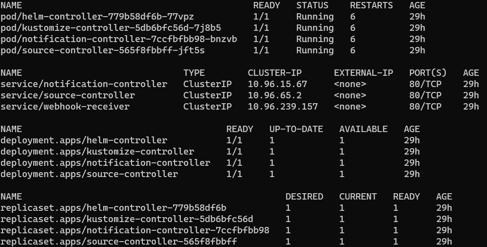

## **Flux**

Flux uses Git Repository as a source of truth and compares the desired state defined in this repository with the kubernetes cluster. If there would be any changes in the YAML files in this repository, the flux will triger the kubectl to apply the changes. The overall process is as follow:

1. Installing Flux on a cluster
2. Add sources that Flux should watch

### **Install Flux**

```
brew install fluxcd/tap/flux
```

or using CLI:

```
curl -s https://fluxcd.io/install.sh | sudo bash
```

Flux compares a source-of-truth for infrastructure state and generates the changes that should be applied to cluster.

### **Namespace**

First step is to create a namespace in kubernetes:

```
kubectl create ns <namespace-name>
```

### **Current Context**

Flux will be installed on the current cluster. So, make sure that the right cluster is selected:

```
kubectl config current-context
```

If you want to see tha available clusters or change the active cluster use the following commands:

```
kubectl config get-contexts
kubectl cluster-info --context <cluster-name>

kubectl config use-context <context-name>
```

### **Set Credentials**

Flux needs write & read access to a repository to write its own configurations and sync the changes with the cluster. So, an access token should be provided for flux.

Github **personal access token** and **username** should be set as environment variables:
**AccessToken should be created with all of the permissions under the repo section**

```
export GITHUB_TOKEN=<your-token>
export GITHUB_USER=<your-username>
export GITHUB_REPOSITORY=<github-repository>
```

### **Flux Requirements Check**

Check if all requirements are meet before bootstraping. Bootstraping installs flux on cluster.

```
flux check --pre
```

### **Bootstrap**

The following command works with repos owned by GitHub organizations.

```
flux bootstrap github \
  --owner=$GITHUB_ORGANIZATION \
  --repository= $GITHUB_REPOSITORY \
  --branch=feature-flux-init
  --path=app-cluster \
  --personal
```

This command does the following steps:

- Connects to GitHub
- Creates repository if not exists
- Switches to branch that is specified in **branch**
- Creates the **path** directory in the repository if not exists. Puts all required manifests. Flux monitors this path for any changes. Also, you can use different paths, for different clusters, and control them from the same repository.
- Creates a deploy-key on the repository

Verify the changes applied to kubernetes cluster:

```
kubectl get all -n <namespace>
```



### **Clone the Flux Repository**

By bootstraping, flux creates a repository based on the credentials and information that you provided in the previous step. Clone this repository for the next step. We want to configure the flux. The configuration creates some manifest files, then these manifest files should be pushed to the remote repository.

1. Clone Flux Repo
2. Navigate to the Flux Repo Directory

### **Add Sources to Watch**

At this step, we have a flux up and running in the cluster. But, there's no source to be watched and synced with. By source, we mean kubernetes manifest files that will be applied to our infrastructure. So, it's required to map flux to some sources that keep the kubernetes manifest files. This is a two-step procedure:

1. Define the source
2. Map the source

```
flux create source git <name> \
  --url=https://github.com/<GITHUB_USER>/<GITHUB_REPO> \
  --branch=main \
  --interval=30s \
  --export > ./app-cluster/staging/<name>-source.yaml
```

This command creates a manifest file for accessing the github source. Make sure the path is correct to place the exported file. If the path does not exist, you will get an error.

Now you need to tell flux, to use the provided source manifest, and watches a path for any changes:

```
flux create kustomization <name> \
  --target-namespace=default \
  --source=<source-name> \
  --path="./kubernetes" \
  --prune=true \
  --interval=5m \
  --export > ./app-cluster/staging/<name>-kustomization.yaml
```

- name: choose a name
- source: should match the source name you chose for the previous step
- path: the path to the directory in the repository that keeps manifest files.

### **Push changes to Flux Repository**

Now we should push all changes to the flux repository. Once the repo is updated, the flux watches the sources for any changes based on the intervals provided.

### **Verify**

If you apply any changes to manifest at the source repository, the pods will be created again. This is what flux is doing.

```
flux get kustomizations --watch
```

```
kubectl -n default get deployments,services
kubectl get pods
```
