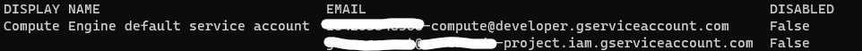

## **GitHub Actions and GCR**

### **Objective:** Build docker image of the app and publish to GCR (Google Container Registry) using github actions.

Requirements to follow:

- Have a google account
- Have a google project under your account
- setup and prepare `gcloud` CLI

### Loging to GCloud

Use the following command to login to gcloud. Follow the steps provided by this command to login to the google account.

```
gcloud auth login
```

### Enable GCR

By default, the services are not enabled. So, we need to enable the GCR.

```
gcloud services enable \
	containerregistry.googleapis.com \
	container.googleapis.com
```

### Create Service Account

You need a service account in gcloud. To do so, use this command to create the service account:

```
gcloud iam service-accounts create <SERVICE_ACCOUNT_NAME>
```

Then, list the service accounts to get the email address of the account you just created.

```
gcloud iam service-accounts list
```

The result of this command is something like this:



Use the service account ending with `@developer.gserviceaccount.com`.

Now, add roles to the service account you just created.

```
gcloud projects add-iam-policy-binding <GOOGLE_PROJECT_ID> \
  --member=serviceAccount:<SERVICEACCOUNT_EMAIL> \
  --role=roles/container.admin \
  --role=roles/storage.admin \
  --role=roles/container.clusterViewer
```

Retrieve the json key file for the service account:

```
gcloud iam service-accounts keys create <KEY_NAME>.json --iam-account=<SERVICEACCOUNT_EMAIL>
```

Create a Base64 of your key and store it. We need the b64 value for the next step.

```
cat <KEY_NAME>.json | base64
```

### Store Secret Keys as GitHub Secrets

Define these keys in GitHub secrets and use the values that you retrieved in previous steps.

- GCR_KEY : B64 Key of the service account
- GPROJECT_ID : Google Project Id

### Create GitHub Action

- Clone the repository and checkout to a new branch.
- On root of the repository create this directory: `.github/workflows/`.
- Create a .yaml file and use the following content:

```
name: Build and Deploy to GKE

on:
  # Trigger the workflow on push or pull request,
  # but only for the main branch
  push:
    branches:
      - main
  pull_request:
    branches:
      - main

env:
  PROJECT_ID: ${{ secrets.GPROJECT_ID }}
  IMAGE: python-webapp

jobs:
  setup-build-publish:
    name: Setup, Build, Publish
    runs-on: ubuntu-latest
    environment: production

    steps:
      - name: Checkout
        uses: actions/checkout@v2

      # Setup gcloud CLI
      - uses: google-github-actions/setup-gcloud@94337306dda8180d967a56932ceb4ddcf01edae7
        with:
          service_account_key: ${{ secrets.GCR_KEY }}
          project_id: ${{ secrets.GPROJECT_ID }}

      # Configure Docker to use the gcloud command-line tool as a credential
      # helper for authentication
      - run: |-
          gcloud --quiet auth configure-docker

      # Build the Docker image
      - name: Build
        run: |-
          docker build \
            --tag "gcr.io/$PROJECT_ID/$IMAGE:$GITHUB_SHA" \
            --build-arg GITHUB_SHA="$GITHUB_SHA" \
            --build-arg GITHUB_REF="$GITHUB_REF" \
            .

      # Push the Docker image to Google Container Registry
      - name: Publish
        run: |-
          docker push "gcr.io/$PROJECT_ID/$IMAGE:$GITHUB_SHA"
```

You can edit this yaml file based on your own requirements. However, this github action triggers on every push and PR on main branch. Then, will create and publish a docker image to the GCR.

### Kustomize

You can use kustomize in github actions. The following is a sample of using kustomize to build the manifests in github actions:

```
# Set up kustomize
    - name: Set up Kustomize
      run: |-
        curl -sfLo kustomize https://github.com/kubernetes-sigs/kustomize/releases/download/v3.1.0/kustomize_3.1.0_linux_amd64
        chmod u+x ./kustomize

# Deploy the Docker image to the GKE cluster
    - name: Deploy
      run: |-
        ./kustomize edit set image gcr.io/PROJECT_ID/IMAGE:TAG=gcr.io/$PROJECT_ID/$IMAGE:$GITHUB_SHA
        ./kustomize build . | kubectl apply -f -
        kubectl rollout status deployment/$DEPLOYMENT_NAME
        kubectl get services -o wide
```
